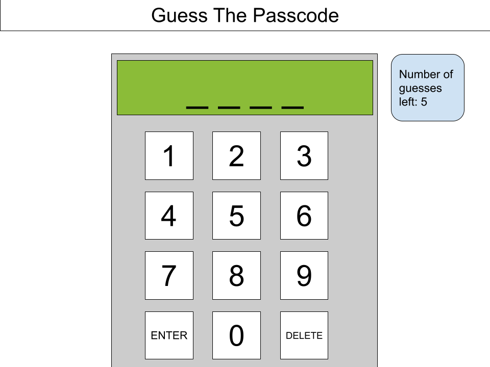

### 2. Wireframe

This will be my wireframe to guide how I design my HTML and CSS

### Pseudocode planning 

plan out game loop (player must correctly guess a four-digit passcode within time limit ** changed from number of guesses**) 

figure out necessay variables

build out basic init() function

build other basic functions

find out and code event listeners 
(get buttons on keypad to work)

manage user inputs and address accordingly

